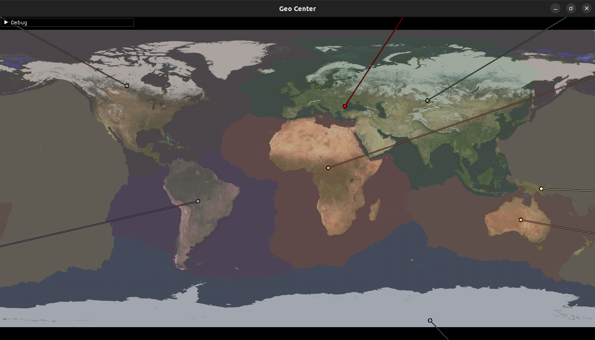

I've heard too many people say "this lies at the geographic center of this continent" so I decided to calculate the continent centers-of-mass myself.
Based on the above-water land on the 7 major plates, and me arbitrarily picking what major-plates to merge each minor plate into.
Using WGS84 calculations for the Earth spheroid.



```
com lat lon =	[43.743060471376, 28.633003358369, 9.3132257461548e-10]
mask	7f8dac	com	[-0.1147159674605, -0.49374141426629, 0.74669396227574]	com lat lon	[56.00801406261, -103.08004490389, 0]
mask	72a17f	com	[0.11895888288724, 0.58656881296191, 0.64116665113268]	com lat lon	[47.162666518965, 78.535637139996, 9.3132257461548e-10]
mask	b082ad	com	[0.46298723831288, -0.80603265968254, -0.22600753410735]	com lat lon	[-13.754277899387, -60.126829340767, 0]
mask	7a9afb	com	[0.87086831060408, 0.29184243585417, 0.10188556591835]	com lat lon	[6.3722459295164, 18.52685637012, 0]
mask	82b4fc	com	[-0.62614105112921, 0.62691560245902, -0.41024220923934]	com lat lon	[-24.991365744801, 134.96458379082, 0]
mask	aae6fe	com	[-0.6896382721234, 0.44225166858296, -0.088433870334194]	com lat lon	[-6.202054070356, 147.32873346015, 0]
mask	be9d8a	com	[0.012111580846256, 0.069518086242592, -0.96603009543996]	com lat lon	[-85.85002610996, 80.117011077865, -9.3132257461548e-10]
masks:
[7512447, 8035067, 8359340, 8566012, 11200254, 11567789, 12492170]
angle differences:
[[0, 65.189920082696, 77.190906857051, 87.97843268407, 80.388779559674, 132.1092590037, 132.79437714586],
[65.189920082696, 0, 101.61556487429, 116.60780844267, 129.12722576283, 80.563424803219, 94.330555361781],
[77.190906857051, 101.61556487429, 1.2074182697257e-06, 128.12464824491, 106.02364024553, 78.23045078511, 149.99994305987],
[87.97843268407, 116.60780844267, 128.12464824491, 0, 22.123035707852, 138.77167166083, 62.799813431578],
[80.388779559674, 129.12722576283, 106.02364024553, 22.123035707852, 0, 146.29576856389, 82.236191586978],
[132.1092590037, 80.563424803219, 78.23045078511, 138.77167166083, 146.29576856389, 1.2074182697257e-06, 79.559954749245],
[132.79437714586, 94.330555361781, 149.99994305987, 62.799813431578, 82.236191586978, 79.559954749245, 0]]
```

naturalearthdata: https://github.com/nvkelso/natural-earth-vector

visibleearth: https://visibleearth.nasa.gov/view.php?id=73963

https://commons.wikimedia.org/wiki/File:Global_sea_levels_during_the_last_Ice_Age.jpg
